# Distributed Multi-VM Inference System on AWS

This project deploys a distributed inference system using AWS and the iii quickstart project. The system is split across multiple virtual machines inside a private network and exposes model inference through a JSON HTTP API.

## Architecture

The system is deployed across two EC2 instances inside a custom VPC.

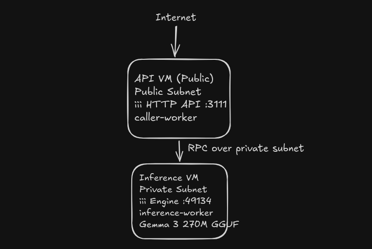

```text
Internet
    ↓
Internet Gateway
    ↓
Public subnet
    ├── API VM
    │      ├── iii-http (3111)
    │      └── caller-worker
    │
    └── NAT Gateway
            ↓
Private subnet
    └── Inference VM
            └── inference-worker (49134)
```

### High-Level Flow

1. Client sends request to `/v1/chat/completions`
2. API VM receives request through `iii-http`
3. `caller-worker` forwards request via RPC
4. Inference worker executes model inference
5. Response is returned to API layer

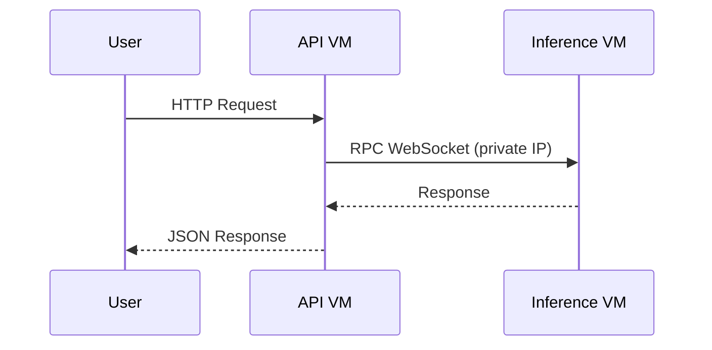
---

## Infrastructure

Provisioned using Terraform.

### Components

* Custom VPC
* Public subnet (API VM)
* Private subnet (Inference VM)
* Internet Gateway
* NAT Gateway
* Route tables
* Security Groups
* 2 EC2 instances
* Terraform outputs

### VM Design

#### API VM (Public Subnet)

Responsibilities:

* Hosts HTTP API (`127.0.0.1:3111`)
* Runs `caller-worker`
* Accepts incoming traffic
* Communicates with inference worker via private networking

#### Inference VM (Private Subnet)

Responsibilities:

* Runs inference worker
* Loads Gemma 3 270M GGUF model
* Handles inference requests
* Not exposed publicly

---

## Networking Design

### Security Model

Only the API VM is publicly accessible.

#### API VM

Allowed:

* SSH (`22`)
* HTTP API (`3111`)

#### Inference VM

Allowed:

* RPC port (`49134`) only from API VM security group
* SSH from API VM

The inference machine is not exposed to the public internet.

---

## Infrastructure as Code

Terraform files are inside:

```text
devops-infra/terraform
```

### Terraform Structure

```text
terraform/
├── provider.tf
├── main.tf
├── variables.tf
├── outputs.tf
├── terraform.tfvars
```

### Run Terraform

Initialize:

```bash
terraform init
```

Validate:

```bash
terraform validate
```

Preview:

```bash
terraform plan
```

Provision:

```bash
terraform apply
```

Example outputs:

```text
api_public_ip = 13.61.181.197
inference_private_ip = 10.0.2.191
```
.png>)
---

## Deployment Configuration

Systemd unit files are included under:

```text
deployment/systemd/
```

```bash
sudo cp deployment/systemd/*.service /etc/systemd/system/

sudo systemctl daemon-reload

sudo systemctl enable iii-api
sudo systemctl enable caller-worker
sudo systemctl enable inference-worker

sudo systemctl start iii-api
sudo systemctl start caller-worker
sudo systemctl start inference-worker
```

## Deployment Steps

### 1. Clone Repository

```bash
git clone https://github.com/paramcodes/devops-infra.git
```

### 2. API VM Setup

Install dependencies based on your system(here amazon-linux):

```bash
sudo dnf update -y
curl -fsSL https://bun.sh/install | bash
source ~/.bashrc
```

Install iii:

```bash
curl -fsSL https://iii.sh/install | bash
```

Start iii engine:

```bash
iii
```

Start caller worker:

```bash
cd workers/caller-worker
bun install
bun src/worker.ts
```

### 3. Inference VM Setup

Install dependencies:

```bash
sudo dnf update -y
sudo dnf install python3.11 python3.11-pip tmux git -y
```

Create Python virtual environment:

```bash
cd workers/inference-worker
python3.11 -m venv .venv311
source .venv311/bin/activate
```

Install requirements:

```bash
pip install -r requirements.txt
```

Start worker:

```bash
python3.11 inference_worker.py
```

---

## API Endpoint

### POST `/v1/chat/completions`

Example:

```bash
curl -X POST http://127.0.0.1:3111/v1/chat/completions \
-H "Content-Type: application/json" \
-d '{
  "messages": [
    {
      "role":"user",
      "content":"Explain Redis in simple words"
    }
  ]
}'
```

---

## Challenges Faced & Debugging

### 1. SSH & Networking Issues

**Problem**

Initially, SSH access and inter-machine connectivity failed due to networking and security configuration problems.

**Root Cause**

* Incorrect Security Group configuration
* Missing/incorrect routing assumptions
* Confusion between public vs private network reachability

**Fix**

* Corrected inbound SSH rules (`22`)
* Verified connectivity using `nmap`, `nc`, and `curl`
* Ensured API VM could communicate with inference VM through private networking

**Learning**

This reinforced the importance of validating network paths and debugging layer-by-layer instead of assuming application-level failures.

---

### 2. Worker Registration & Engine Routing Issues

**Problem**

The HTTP route `/v1/chat/completions` initially returned `404`, and later RPC calls failed with:

```text
Function inference::run_inference not found
```

**Root Cause**

Workers were connected to the wrong iii engine instance and function registration was happening against an incorrect endpoint.

For example, the `caller-worker` was temporarily registered against the inference engine instead of the API engine, which caused route registration failures.

**Fix**

* Verified engine endpoints (`localhost` vs private VM IP)
* Corrected `III_URL` environment configuration
* Restarted workers with correct engine targets
* Verified function registration logs

**Learning**

In distributed systems, a process being “alive” does not imply the system is wired correctly. Service registration and network topology must also be validated.

---

### 3. Worker Path / Configuration Issues

**Problem**

Worker discovery and startup behavior initially failed because of incorrect assumptions around worker locations and runtime configuration.

**Root Cause**

The iii engine depends on correct worker paths and runtime configuration inside `config.yaml` and worker definitions.

Incorrect worker configuration prevented expected registration and startup behavior.

**Fix**

* Updated worker paths in configuration
* Validated worker runtime configuration
* Started workers manually for debugging before automating startup

**Learning**

Configuration management becomes increasingly important in distributed systems because small path/config mismatches can cascade into runtime failures.

---

### 4. RPC Communication Failures

**Problem**

API worker could not communicate with inference worker.

**Root Cause**

RPC port (`49134`) accessibility and routing assumptions were incorrect during early setup.

**Fix**

* Restricted inference communication to private networking
* Verified RPC communication using:

```bash
nc -vz <private-ip> 49134
```

* Confirmed engine registration and connectivity

**Learning**

Connectivity debugging should begin at the transport layer (ports/network) before moving into application logic.

---

### 5. Storage Constraints

**Problem**

Dependency installation failed with:

```text
No space left on device
```

while installing PyTorch and model dependencies.

**Root Cause**

Default EC2 root volume size (`8GB`) was insufficient for Python dependencies, model weights, and inference tooling.

**Fix**

* Increased volume size to `20GB`
* Resized partition and filesystem
* Updated Terraform configuration to provision larger root volumes by default

**Learning**

Infrastructure defaults are often unsuitable for ML workloads and should be sized according to workload requirements.

---

### 6. Memory Constraints & OOM Failures

**Problem**

Inference worker crashed during model loading.

**Root Cause**

Model loading exceeded available RAM on `t3.micro`, causing OOM kills.

**Fix**

* Investigated memory failures using `dmesg`
* Added swap memory
* Used a smaller quantized GGUF model (`Gemma 3 270M Q8`)
* Reduced generation complexity during testing

**Learning**

Model-serving systems are constrained as much by hardware economics as by software correctness.

---

### 7. API Routing & HTTP Trigger Issues

**Problem**

The API initially returned:

```text
404 Not Found
```

despite the service running.

**Root Cause**

The HTTP trigger was not registered because the worker responsible for route registration was connected to the wrong engine.

**Fix**

* Verified worker registration logs
* Confirmed:

```text
POST /v1/chat/completions → http::run_inference_over_http
```

* Retested using `curl`

**Learning**

A healthy process does not guarantee a healthy request path. Route registration must be verified explicitly.

---

### 8. End-to-End Inference Timeout Tradeoff

**Problem**

Inference requests occasionally timed out on constrained hardware.

**Root Cause**

CPU-only inference on a small EC2 instance (`t3.micro`) resulted in slow model execution.

**Fix**

* Increased timeout values
* Reduced generation size
* Verified prompt execution reached the inference layer

Example proof:

```text
PROMPT SENT TO MODEL:
Explain Redis in simple words
END PROMPT
```

**Learning**

For constrained systems, validating architecture correctness can be more important than optimizing latency during early prototyping.

## Tradeoffs

Due to limited compute resources (`t3.micro`), inference latency was higher than expected for CPU-only model execution.

The system successfully validates:

* Multi-VM deployment
* Private subnet communication
* RPC worker orchestration
* HTTP API routing
* Infrastructure-as-Code provisioning
* End-to-end request flow to inference layer

Further optimization would include:

* Larger instance types
* Faster inference runtime
* Containerization
* CI/CD automation

---

## Evidence

Screenshots included:

* Terraform provisioning


* VPC and subnet setup
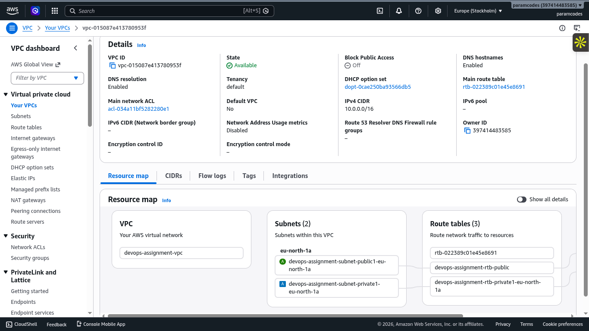
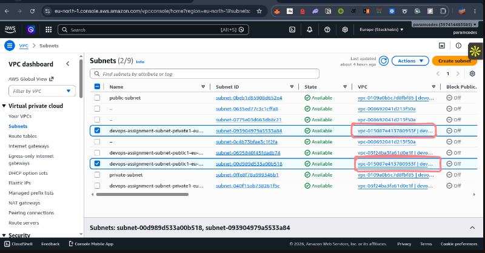

* EC2 instances

| 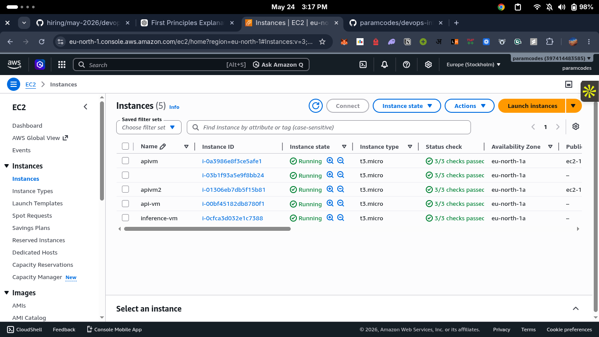 | 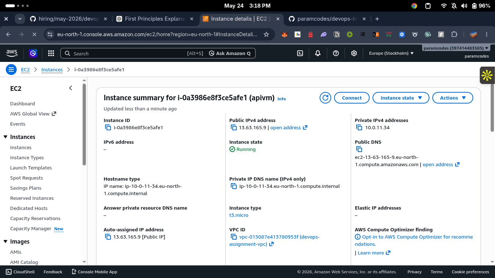 |
|-------------------------------|-------------------------------|
| 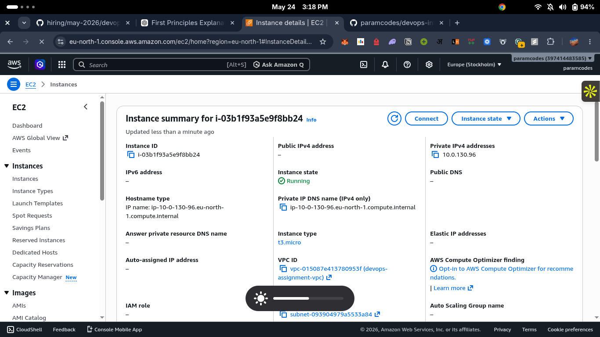 | 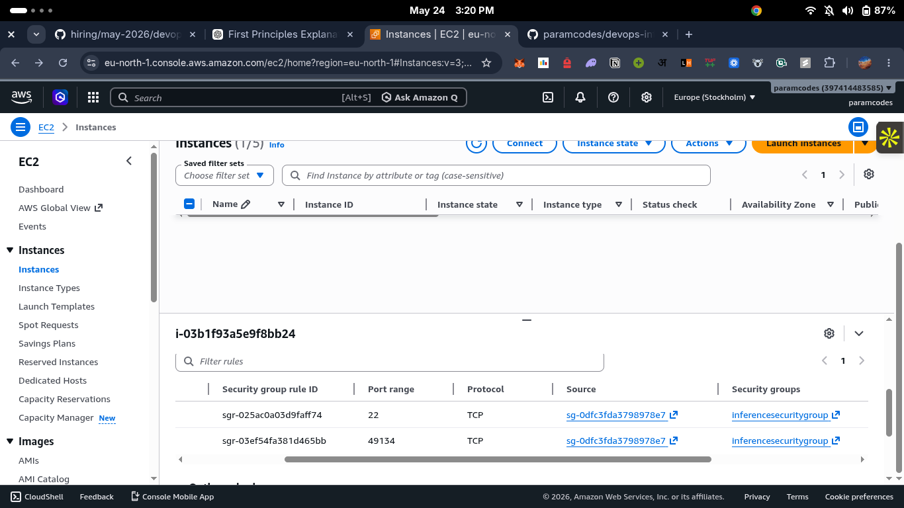 |

* Security groups

| 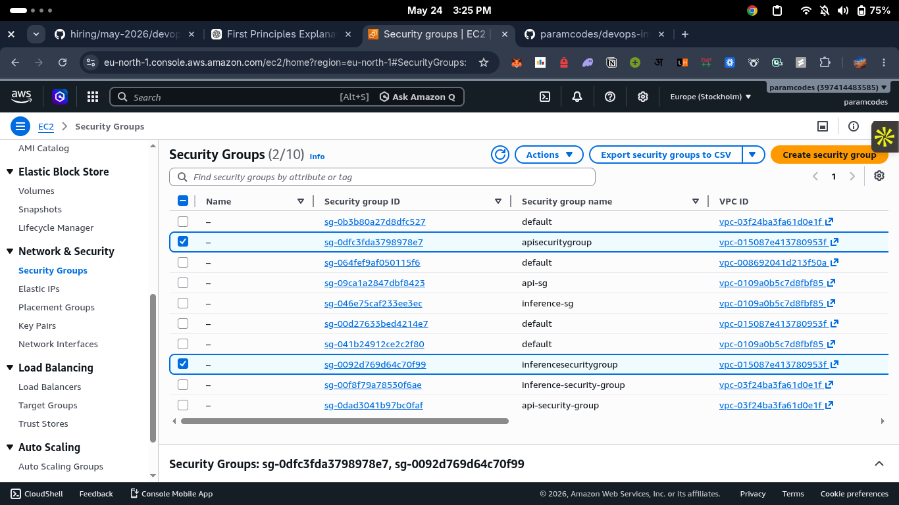 | 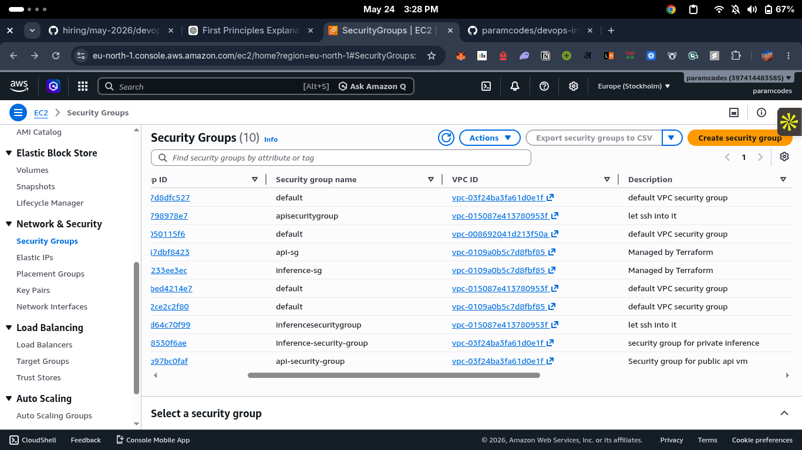 |
|-------------------------------|-------------------------------|
| 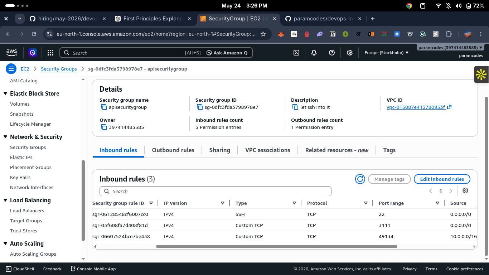 | 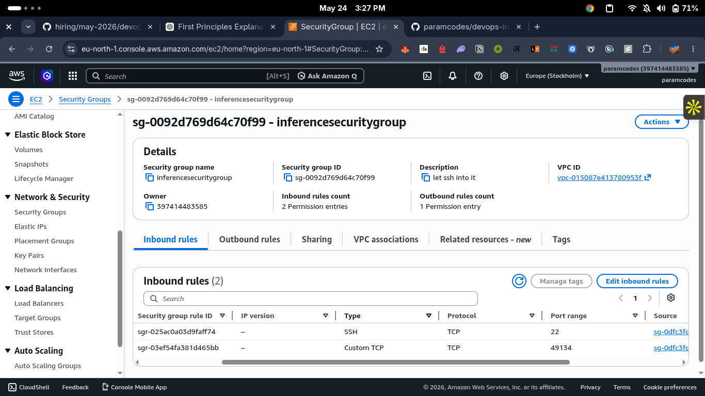 |

* Worker registration logs


* API invocation
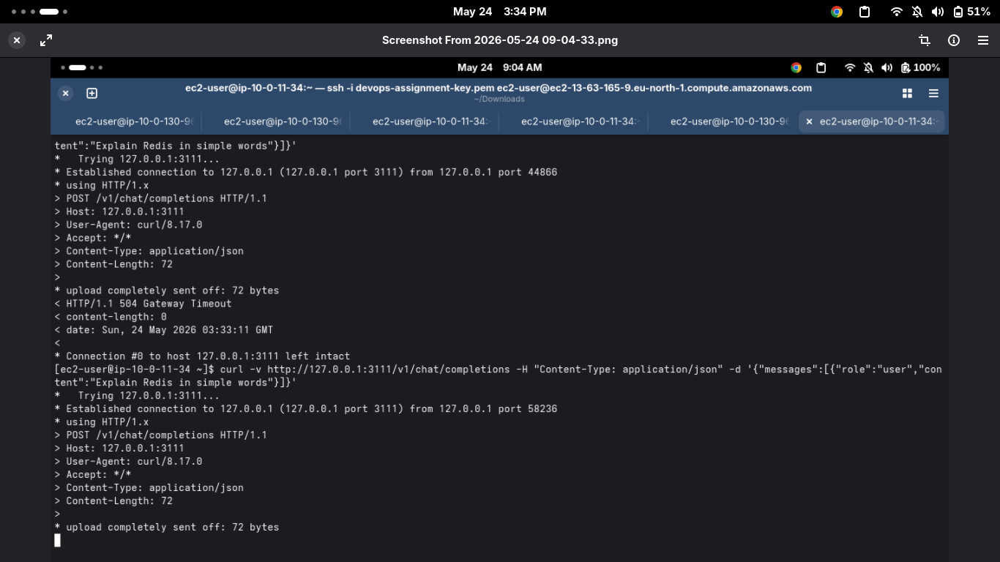

* Model prompt execution


---

## Technologies Used

* AWS EC2
* Terraform
* iii Engine
* Python
* TypeScript
* Bun
* GGUF Models
* Gemma 3 270M
* Linux
* SSH
* Networking (VPC, NAT, Security Groups)


## Production Hardening & Scaling Considerations

### What I would harden before production

Before putting this system into production, I would improve reliability, security, observability, and deployment automation.

First, I would improve **security and network isolation**. The API VM would remain the only public entry point, while inference workers would stay private. Security groups would be tightened further using least-privilege rules, SSH access would be restricted to specific IPs or replaced with AWS Systems Manager Session Manager, and secrets/configuration would be managed using AWS Secrets Manager or environment-based secret injection instead of manual setup.

Second, I would improve **observability and monitoring**. Logs, metrics, and traces should be centralized using systems such as CloudWatch, OpenTelemetry, Prometheus, or Grafana. Health checks, alerting, request latency monitoring, worker crash detection, and infrastructure dashboards would be added to make failures easier to detect and debug.

Third, I would improve **reliability and deployment automation**. Instead of manually starting workers, services would run under `systemd`,`tmux` or containers with restart policies, i had used `tmux`. CI/CD pipelines would automate testing and deployment. Autoscaling groups, backups, better error handling, retries, and request timeouts would be introduced to make the system more fault tolerant.

Finally, I would improve **performance and API robustness** by adding request validation, authentication, rate limiting, caching, queue-based workload management, and structured logging. Containerization using Docker and orchestration with Kubernetes or ECS would also make deployments more reproducible and scalable.

### What I would do differently if the model were 100x larger

If the model were roughly 100x larger, the system design would change significantly.

A much larger model would not realistically run on a small CPU instance. I would move inference to **GPU-backed instances** and separate the inference layer from the API layer more aggressively. Instead of a single inference VM, I would introduce multiple inference workers behind a queue or load balancer so requests could be distributed horizontally.

Model loading and memory usage would become major concerns. I would likely use model sharding, quantization, batching, and optimized inference runtimes such as vLLM, TensorRT-LLM, or other high-performance serving systems to reduce latency and improve throughput.

I would also redesign request handling to support asynchronous inference. Instead of blocking HTTP requests, the API could enqueue jobs and stream results or return task IDs for long-running inference. Caching, autoscaling, request prioritization, and dedicated observability for GPU utilization and latency would become important operational concerns.

In short, the current architecture proves the distributed system design, but a model 100x larger would require a much stronger focus on GPU infrastructure, distributed serving, batching, observability, and cost-aware scaling.
